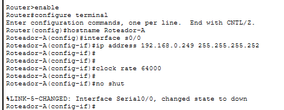

Router>
Router>enable
Router#configure terminal
Enter configuration commands, one per line.  End with CNTL/Z.
Router(config)#hostname Roteador-B
Roteador-B(config)#interface s0/0
Roteador-B(config-if)#ip address 192.168.0.250 255.255.255.252
Roteador-B(config-if)#no shut 

Roteador-B(config-if)#
%LINK-5-CHANGED: Interface Serial0/0, changed state to up

Roteador-B(config-if)#interface f0/0
%LINEPROTO-5-UPDOWN: Line protocol on Interface Serial0/0, changed state to up

Roteador-B(config-if)#interface f0/0
Roteador-B(config-if)#ip address 192.168.1.0 255.255.255.0
Bad mask /24 for address 192.168.1.0
Roteador-B(config-if)#no shut 

Roteador-B(config-if)#
%LINK-5-CHANGED: Interface FastEthernet0/0, changed state to up

%LINEPROTO-5-UPDOWN: Line protocol on Interface FastEthernet0/0, changed state to up

Roteador-B(config-if)#interface f0/1
Roteador-B(config-if)#ip address 192.168.9.254 255.255.255.0
Roteador-B(config-if)#no shut

Roteador-B(config-if)#
%LINK-5-CHANGED: Interface FastEthernet0/1, changed state to up

%LINEPROTO-5-UPDOWN: Line protocol on Interface FastEthernet0/1, changed state to up

Roteador-B(config-if)#interface f0/0
Roteador-B(config-if)#ip address 192.168.8.254 255.255.255.0
Roteador-B(config-if)#no shut
Roteador-B(config-if)#exit
Roteador-B(config)#ip route 192.168.1.0 255.255.255.0 192.168.0.249
Roteador-B(config)#ip route 192.168.2.0 255.255.255.0 192.168.0.249
Roteador-B(config)#ip route 192.168.3.0 255.255.255.0 192.168.0.249
Roteador-B(config)#end
Roteador-B#
%SYS-5-CONFIG_I: Configured from console by console

Roteador-B#